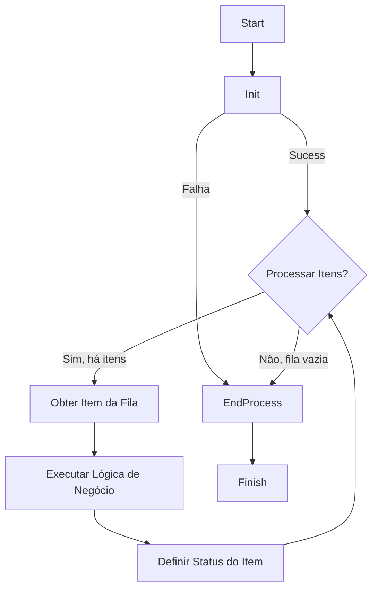

# Guia Mestre de Arquitetura e Estimativa para Automações RPA

Este documento é a fonte canônica da verdade para o design, desenvolvimento e estimativa de todos os projetos de Automação Robótica de Processos (RPA) utilizando o Framework T2C. Seu propósito é estabelecer um framework rigoroso que garanta que cada automação seja Robusta, Escalável, Manutenível e Previsível.

---

## 1. Introdução e Filosofia

Este não é mais um guia; é a **Bíblia da Arquitetura de Automação**. Ele foi projetado para ser o único documento de referência necessário para qualquer pessoa (ou IA) projetar, nomear, estimar e implementar um projeto de RPA, garantindo que o resultado final siga os padrões de excelência definidos.

A filosofia central é a **decomposição inteligente**: processos de negócio complexos são quebrados em robôs especialistas, e robôs são quebrados em tarefas funcionais claras. Esta granularidade é a base para a resiliência e a previsibilidade.

---

## 2. Componentes Fundamentais da Arquitetura de Automação

Toda automação é construída a partir de um conjunto de componentes e padrões arquiteturais. Compreendê-los é o primeiro passo para um design robusto.

### 2.1 Filas (Queues): O Coração da Automação

A fila é o componente central do nosso ecossistema. Ela é a fonte da verdade para o trabalho a ser feito.

*   **O que é?** Uma lista estruturada de itens de trabalho. Cada item (ou "transação") representa uma unidade de processamento (ex: uma nota fiscal para validar, um cliente para cadastrar).
*   **Por que é Obrigatória?**
    *   **Desacoplamento:** O robô que cria o trabalho (Produtor) não precisa saber nada sobre o robô que o executa (Consumidor). Eles só precisam concordar com o "contrato" da fila.
    *   **Escalabilidade:** Para aumentar a vazão, basta adicionar mais robôs consumidores à mesma fila, sem alterar a arquitetura.
    *   **Resiliência:** Se um robô falhar ao processar um item, o item pode ser retentado automaticamente ou marcado para análise humana sem perder o trabalho.
    *   **Auditabilidade:** As filas fornecem um log completo de todos os itens processados, pendentes e com falha.

### 2.2 A Anatomia de um Robô: O Ciclo de Vida da Execução

Todo robô, independentemente de sua função, deve seguir uma estrutura de execução padronizada em três estágios, inspirada no "Robotic Enterprise Framework" (REFramework).

#### 1. Init (Inicialização)
*   **Propósito:** Preparar todo o ambiente necessário para a execução. É a fase de "tudo ou nada".
*   **Ações Típicas:** Ler arquivos de configuração, obter credenciais, fazer login em todas as aplicações necessárias (SAP, portais web, etc.), inicializar variáveis.
*   **Regra de Ouro:** Se qualquer passo no Init falhar, o robô deve encerrar a execução imediatamente e reportar o erro. Nenhum item da fila deve ser processado se o ambiente não estiver 100% pronto.
*   **Implementação:** Método `T2CInitAllApplications.execute()`.

#### 2. Main Transaction Loop (Onde o Trabalho Acontece)
*   **Propósito:** Processar um item da fila por vez, de forma isolada e transacional.
*   **Fluxo Obrigatório:**
    1.  **Obter Item da Fila:** Pega o próximo item disponível. Se não houver itens, o loop termina e o robô vai para o End Process.
    2.  **Processar Item:** Executa a lógica de negócio principal daquele robô.
    3.  **Definir Status do Item:** Ao final do processamento, o robô deve marcar o item com um dos três status:
        *   **Sucesso:** O item foi processado completamente e com sucesso.
        *   **Exceção de Negócio:** O item não pôde ser processado devido a uma regra de negócio (ex: "documento inválido", "cliente não encontrado"). Isso não é um erro do robô; é um resultado esperado.
        *   **Exceção de Aplicação:** Ocorreu um erro inesperado (ex: o sistema travou, um seletor não foi encontrado, a API retornou erro 500). O item deve ser retentado automaticamente, se configurado.
*   **Implementação:** Método `T2CProcess.execute()`.

#### 3. End Process (Finalização)
*   **Propósito:** Encerrar a operação de forma limpa e segura.
*   **Ações Típicas:** Fazer logout de todas as aplicações, fechar conexões com bancos de dados, gerar e enviar um relatório de resumo da execução.
*   **Regra de Ouro:** O End Process deve ser executado sempre, quer o Main Loop tenha sido bem-sucedido, quer tenha sido interrompido por uma falha no Init.
*   **Implementação:** Método `T2CCloseAllApplications.execute()`.



### 2.3 O Robô Dispatcher: O Maestro da Orquestração

O Dispatcher é um tipo especializado de robô cuja principal responsabilidade é **popular as filas de trabalho**.

*   **Quando é Necessário?** Sempre que houver uma fonte de dados em massa (Excel, E-mail, Banco de Dados, API List) que precisa ser iterada para criar itens transacionais.
*   **Modos de Operação:**
    *   **Standalone (Ingestion):** É o primeiro robô do processo. Ele não consome fila, ele é acionado por agendamento (Time Trigger). Sua função é ler a fonte bruta (ex: baixar e-mail) e criar itens na fila.
    *   **Queue-Driven (Intermediate):** Em processos complexos, um Dispatcher pode consumir um item de uma fila "pai" (ex: ID de Processo) para gerar N itens em uma fila "filho" (ex: Lista de Notas Fiscais daquele processo).
*   **O que ele NÃO Faz (Anti-Patterns Proibidos):**
    *   ❌ **NUNCA** executa lógica de negócio complexa ou validações de regras (isso é papel do Performer).
    *   ❌ **NUNCA** envia e-mails de negócio ou realiza ações em sistemas de destino (ex: criar pedido).
    *   ❌ **NUNCA** interage com o VerifAI para obter resultados (ele apenas coleta os arquivos brutos).
    *   **Regra:** Se o robô está tomando decisões de negócio ("Se valor > X, então..."), ele NÃO é um Dispatcher.

### 2.4 O Robô Performer: O Especialista da Execução

O Performer é o robô que consome itens da fila e executa o trabalho pesado.

*   **Regra Mandatória:** Todo Performer deve ser **Queue-Driven**. Ele não itera Excel, ele não lê pasta de e-mail em loop infinito, ele não faz queries no Notion buscando status.
*   **O que ele NÃO Faz (Anti-Patterns Proibidos):**
    *   ❌ **NUNCA** tem uma etapa "Monitor" ou "Watch". Ele é cego para o mundo exterior; ele só enxerga a Fila.
    *   ❌ Se você precisa monitorar e-mails para processar respostas, você precisa de um **Dispatcher** para ler o e-mail e criar um item de fila, e um **Performer** para processar esse item.
*   **Por que?** Isso garante que múltiplos Performers possam trabalhar na mesma fila simultaneamente (escalabilidade horizontal).

---

## 3. Princípios de Design de Arquitetura

A decisão de quantos robôs criar é a mais crítica do projeto. Siga estes princípios rigorosamente.

### 3.1 O Princípio da Responsabilidade Única (PRU)
Cada robô deve ter uma, e apenas uma, responsabilidade principal. Um robô que interage com o sistema A para extrair dados não deve ser o mesmo que implementa a lógica de negócio ou atualiza o sistema B. A especialização é a chave para a manutenibilidade e o reuso.

### 3.2 O Princípio do Acionamento por Fila (Queue-Driven)
**Regra Mandatória:** Filas são a única fonte de trabalho para robôs performers.
*   Um robô Performer não deve monitorar ativamente pastas de rede, caixas de e-mail ou estados em um banco de dados.
*   Esta abordagem passiva (baseada em eventos/itens de fila) garante o desacoplamento, a escalabilidade (múltiplos robôs podem consumir da mesma fila) e a resiliência (itens podem ser reprocessados em caso de falha).

### 3.3 O Padrão do Dispatcher
Se um processo possui múltiplos pontos de entrada (ex: e-mail e portal) ou requer uma filtragem complexa para criar os itens de trabalho, um robô Dispatcher deve ser criado.
*   **Responsabilidade:** Ler as fontes de dados, normalizar a informação e popular a fila de trabalho para os robôs performers.
*   **O que NÃO faz:** Lógica de negócio complexa ou processamento transacional demorado.

### 3.4 O Padrão da Fronteira Assíncrona (Sender/Receiver) - EXCLUSIVO PARA VERIFAI

Este padrão é **OBRIGATÓRIO** e de uso **EXCLUSIVO** para automações que utilizam o **VERIFAI** (ou soluções de IDP/IA Assíncronas similares). Ele não deve ser aplicado levianamente para outras APIs lentas, a menos que haja justificativa técnica extrema.

O objetivo é isolar o custo e a complexidade do processamento de IA, garantindo que o robô não fique ocioso aguardando respostas.

#### Estrutura Obrigatória Sender/Receiver:

1.  **Robô Sender (O Iniciador):**
    *   **Responsabilidade Única:** Preparar os documentos/dados e enviá-los para o VerifAI.
    *   **Ação:** Envia a requisição (upload) e captura IMEDIATAMENTE o `job_id` (ou `transaction_id`).
    *   **Output:** Cria um item em uma fila intermediária (ex: `Queue_..._PENDING_RESULTS`) contendo o `job_id` e metadados essenciais.
    *   **Regra de Ouro:** "Fire and Forget". O Sender JAMAIS espera o processamento terminar.
    *   **Restrição Final (The Kill Switch):** Após despachar o `job_id` para a fila, o Sender **DEVE ENCERRAR IMEDIATAMENTE**. É proibido executar qualquer outra lógica de negócio, validação ou interação com outros sistemas após o envio. O robô "morre" ali para garantir a atomicidade do envio.

2.  **Robô Receiver (O Coletor):**
    *   **Responsabilidade Única:** Monitorar a conclusão do processamento no VerifAI e recuperar os dados.
    *   **Mecanismo:** Consome o item da fila `PENDING_RESULTS`, usa o `job_id` para consultar o status (polling inteligente com backoff exponencial) e, somente quando `status == COMPLETED`, baixa o JSON de resultado.
    *   **Output:**
        *   Se Sucesso: Envia os dados extraídos para a próxima etapa (Fila de Processamento ou Sistema Final).
        *   Se Falha na IA: Trata o erro conforme regra de negócio (Human in the Loop ou Rejeição).

**Por que essa separação é Crítica para o VerifAI?**
*   **Otimização de Licença:** Evita que um robô fique "preso" (dormindo) por minutos enquanto a IA processa documentos grandes.
*   **Desacoplamento de Falhas:** Se o serviço de IA instabilizar, o Sender continua enfileirando trabalho, e o Receiver processa quando o serviço voltar, sem perda de dados.
*   **Escalabilidade Independente:** Você pode ter 1 Sender (rápido) alimentando o serviço e 5 Receivers (mais lentos devido ao polling) para dar vazão.

**Regra Absoluta:**
*   Se o projeto usa **VerifAI**, a arquitetura DEVE ter, no mínimo, dois robôs (Sender e Receiver) ou um fluxo que suporte essa assincronicidade via filas. Não tente fazer tudo em um único loop síncrono.

**O Princípio da Latência Infinita:**
Ao desenhar a arquitetura com VerifAI, assuma que a resposta da IA demorará **24 horas** para chegar.
*   Isso impede o erro comum de desenhar um fluxo "Extrair -> Validar -> Enviar" no mesmo robô.
*   Se a resposta demora "24 horas" (no modelo mental), torna-se óbvio que o robô deve morrer após o envio e outro robô deve nascer para processar a resposta.


### 3.5 Separação Transacional vs. Monitoramento
Evite misturar **Criação/Ação Imediata** com **Monitoramento de Longo Prazo** no mesmo robô.
*   **Cenário:** Criar pedido no SAP (rápido) e monitorar entrega (dias).
*   **Solução:** Dividir em **Creator** (faz e termina) e **Monitor** (roda agendado para checar status).
*   **Regra de Tracking:** O monitoramento deve ser centralizado em um robô "Master" que itera sobre os itens ativos, em vez de fragmentar o tracking em múltiplos robôs sequenciais.

### 3.6 Integração com IA e VerifAI
O uso de IA altera a complexidade e a arquitetura.
1.  **Complexidade:** Substitui lógica complexa de Regex/OCR (Pontos 3) por integração de API (Pontos 1 ou 2). As estimativas devem refletir isso.
2.  **Arquitetura:** Impõe o padrão Sender/Receiver (Seção 3.4).
3.  **Fluxo de Dados:** O JSON retornado pela IA deve ser validado (cross-check) contra a fonte de dados original (ex: Notion) antes de prosseguir.

---

## 4. Nomenclatura e Contratos de Dados

A padronização é essencial para a clareza e governança do ecossistema de automação.

### 4.1 Nomenclatura de Projetos (Robôs)

*   **Estrutura:** `prj_<NomeEmpresa>_<IDProcesso>_<SubSiglaOpcional>_<NumeroSequencial>_<NomeSistema>`
*   **Componentes:**
    *   `prj`: Prefixo padrão.
    *   `NomeEmpresa`: Cliente ou unidade de negócio.
    *   `IDProcesso`: Identificador único do processo de negócio (ex: ID55, FIN03).
    *   `SubSiglaOpcional`: Usado para agrupar robôs dentro de um sub-processo (ex: GFIP, ISS).
    *   `NumeroSequencial`: Ordem lógica de execução do robô no fluxo (01, 02, ...).
    *   `NomeSistema`: Principal sistema com o qual o robô interage.
*   **Exemplo Prático:** `prj_PlanoEPlano_ID55_GFIP_03_DIGIT`

### 4.2 Nomenclatura de Filas

*   **Estrutura:** `Queue_<IDProcesso>_<NumeroSequencialRobôConsumidor>_<NomeConformeNecessidade>`
*   **Componentes:**
    *   `Queue`: Prefixo padrão.
    *   `IDProcesso`: Mesmo ID do projeto.
    *   `NumeroSequencialRobôConsumidor`: Número do robô que irá consumir desta fila (ex: se o Robô 04 consome, o número é 04).
    *   `NomeConformeNecessidade`: Descrição sucinta do propósito dos itens na fila.
*   **Exemplo Prático:** `Queue_ID55_04_PENDING_GFIP_VERIFY`

### 4.3 Schemas de Fila (O Contrato de Dados)

Toda fila deve ter um schema de dados (payload) formalmente definido. Este schema é o contrato imutável entre o robô produtor e o consumidor.

**Formato de Definição:**

| Campo | Tipo | Descrição | Exemplo |
| :--- | :--- | :--- | :--- |
| `caminho_arquivo` | String | Caminho de rede completo para o arquivo a ser processado. | `\\share\input\doc1.pdf` |
| `id_transacao` | String | Identificador único da transação no sistema de origem. | `"TRN-2025-12345"` |
| `prioridade` | Integer | Nível de prioridade do item (1-5). | `3` |

### 4.4 Padrões de Código (Variáveis, Classes e Métodos)
Para manter o código legível e consistente:

*   **Variáveis:** `var_<tipo><Nome>` (ex: `var_strNome`, `var_intContador`, `var_dictItem`).
*   **Argumentos:** `arg_<tipo><Nome>` (ex: `arg_strReferencia`, `arg_dictDados`).
*   **Constantes:** `CONS_<TIPO>_<NOME>` (ex: `CONS_STR_URL_BASE`).
*   **Classes:** PascalCase (ex: `T2CProcess`, `T2CQueueManager`).
*   **Métodos:** snake_case (ex: `execute()`, `add_to_queue()`).

---

## 5. Framework de Estimativa de Esforço (FEFP)

Este framework transforma a estimativa de esforço de uma arte subjetiva para um processo de engenharia transparente e repetível. Ele assume uma persona de **Desenvolvedor Sênior** como base para as métricas, e aplica fatores de correção para outros níveis.

### Passo 0: Nível de Complexidade do Projeto (NCP) e Entendimento

Antes de estimar tasks, define-se o tempo fixo para **Entendimento do Processo** (Leitura de DDP, Desenho de Solução, Validação de Acessos).

| Complexidade | Características | Tempo de Entendimento (h) |
| :--- | :--- | :--- |
| **Baixa** | Fluxo linear, 1-2 sistemas, API predominante. | **4h** |
| **Média** | Regras de negócio, mistura UI/API, fluxos simples. | **12h** |
| **Alta** | Regras cruzadas, IA/VerifAI, UI Legada, 4+ Robôs. | **24h** |

### Passo 1: Decomposição em Micro-Tarefas

Cada robô é quebrado em uma lista de tarefas.
*   **Regra da Micro-Tarefa:** Nenhuma tarefa deve exceder **4 horas**. Se exceder, quebre em ações menores.
*   **Regra de Clareza:** Use títulos curtos e descritivos para negócio (ex: "Validar Peso Bruto" em vez de "Parse JSON Payload").

### Passo 2: Avaliação de Complexidade (Sistema de Pontuação)

Para cada micro-tarefa, some os pontos dos **4 fatores** a seguir (4 a 12 pts).

| Fator | Baixo (1 pt) | Médio (2 pts) | Alto (3 pts) |
| :--- | :--- | :--- | :--- |
| **1. Interação com Sistema** | APIs, Arquivos | Web Moderno | SAP, Citrix, IA Assíncrona |
| **2. Lógica de Negócio** | Linear, sem condicional | 2-3 condicionais | Regras aninhadas, cruzamentos |
| **3. Manipulação de Dados** | Estruturado | Semi-estruturado | Não-estruturado |
| **4. Requisito de Resiliência** | Try/catch padrão | Retentativas | Rollback, Recuperação complexa |

### Passo 3: Mapeamento de Pontuação para Tempo Base (Sênior)

A pontuação define o **Tempo Base Sênior** (desenvolvedor experiente).

| Pontuação Total | Nível de Complexidade | Tempo Base Sênior (h) |
| :--- | :--- | :--- |
| **4-5** | **Baixa** (Configurações, Leituras simples) | **2.0 - 4.0** |
| **6-7** | **Média** (Lógica padrão, APIs) | **6.0 - 12.0** |
| **8-9** | **Alta** (Regras complexas, UI instável) | **14.0 - 20.0** |
| **10-12** | **Muito Alta** (Crítico, IA, Legado pesado) | **22.0 - 32.0** |

### Passo 4: Cálculo da Estimativa Final Ajustada

Para refletir a realidade de projetos (curva de aprendizado, ambiente, debug):

1.  **Estimativa da Task:** `Tempo Task = Tempo Base Sênior`
    *   (Nota: Os valores da tabela acima já contemplam o esforço real de projeto. Não usar multiplicadores extras).
2.  **Arredondamento:** Arredondar sempre para cima (0.5h).

### Passo 5: Testes Integrados e Homologação (Macro-Tasks)

Adicionar tarefas explícitas ao final do cronograma para a estabilização do projeto. Estas não são percentuais ocultos, mas **tasks reais** que devem aparecer no backlog.

*   **Regra de Cálculo:** A soma dessas tasks deve corresponder a aproximadamente **30% do Total de Horas de Desenvolvimento**.
*   **Exemplos de Tasks de Teste:**
    *   "Executar Teste Integrado (E2E) - Fluxo Feliz"
    *   "Executar Teste de Exceções e Rollback"
    *   "Acompanhar Homologação Assistida (UAT)"
    *   "Ajustes de Bugs de Homologação"

---

## 6. Guia Definitivo de Construção de Código

Este guia define as normas OBRIGATÓRIAS para a geração de qualquer linha de código. O objetivo é criar códigos **simples, práticos e robustos**.

### 7.1 Nomenclatura Padrão e Rigorosa

A aderência estrita a prefixos e estruturas é mandatória para identificação visual imediata.

| Artefato | Estrutura e Regras Principais | Exemplo |
| :--- | :--- | :--- |
| **Projeto** | `prj_<Empresa>_<Sigla/ID>_<SubSigla?>_<Seq>_<Sistema>` | `prj_LeroyMerlin_CCRT_01_SAP` |
| **Pacotes** | `snake_case` | `conexao_banco`, `utils` |
| **Módulos** | `snake_case` (Prefixo `_` se privado) | `banco_t2c.py`, `_helper.py` |
| **Classes** | `PascalCase` (Prefixo `_` se privada) | `BancoT2C`, `_Logger` |
| **Variáveis** | `var_<tipo><Conteudo>` (camelCase) | `var_strEmailRemetente` |
| **Parâmetros** | `arg_<tipo><Conteudo>` (camelCase) | `arg_intTentativas` |
| **Constantes** | `CONS_<TIPO>_<CONTEUDO>` (UPPER_SNAKE) | `CONS_FLT_PI` |
| **Funções** | `snake_case()` (Prefixo `_` se privada) | `envia_email()`, `_validar()` |
| **Exceções** | `PascalCase` (Sufixo Exception opcional) | `BusinessRuleException` |

**Tipos de Dados e TypeHints:**
*   Sempre usar TypeHints quando o tipo não for inferido automaticamente.
*   Correlação obrigatória:
    *   `str` -> `var_strNome`
    *   `int` -> `var_intIdade`
    *   `float` -> `var_fltValor`
    *   `list` -> `var_listItens`
    *   `dict` -> `var_dictDados`
    *   `bool` -> `var_boolAtivo`

### 7.2 Estrutura e Organização de Arquivos

1.  **Separação por Sistema:** As pastas do projeto devem ser organizadas por sistema ou aplicação alvo (ex: `sap/`, `portal_governo/`, `salesforce/`).
2.  **Pasta Utils:** Código genérico e reutilizável DEVE ir para a pasta `utils`. Não duplique lógica.
3.  **Classes Autocontidas:** As classes devem funcionar de forma similar a bibliotecas (como pandas).
    *   Preferir `@staticmethod` e `@classmethod` para evitar necessidade de instância desnecessária.
    *   Profundidade de herança máxima: 4 níveis.

### 7.3 Qualidade e Robustez do Código

1.  **Comentários:** Use com bom senso. Explique o "porquê" de lógicas complexas. Não explique o óbvio (ex: não comente "clica no botão" acima de um comando `.click()`).
2.  **Loops Seguros:**
    *   Todo `while` deve ter **DUPLA CONDIÇÃO** de parada: a condição de negócio E um contador de tentativas máximas.
    *   Isso previne loops infinitos que travam a automação.
    ```python
    tentativa = 0
    while condicao_negocio and tentativa < max_tentativas:
        # logica
        tentativa += 1
    ```
3.  **Tratamento de Erros (Explicit is better than implicit):**
    *   **Uso Proativo do Raise:** Use `raise` para interromper o fluxo assim que uma regra de negócio falhar.
    *   **Evite Else/Ifs Aninhados:** Prefira "Guard Clauses" (verificações no início que dão raise/return).
    *   **Distinção Clara:**
        *   `Exception`: Erro de sistema/aplicação (o framework tenta novamente).
        *   `BusinessRuleException`: Erro de negócio (o framework marca o item e segue para o próximo).
4.  **Estruturas Condicionais:** Evite aninhamento profundo. Use `and`/`or` ou atribuições ternárias para simplificar.

### 7.4 Diretrizes Específicas do Framework T2C

1.  **Ponto de Entrada:** A inicialização de aplicações ocorre **exclusivamente** em `T2CInitAllApplications.py`.
2.  **Maestro:** O framework suporta operação COM ou SEM Maestro.
    *   Para dev/teste local: Pode deixar configs em branco.
    *   Para Produção (RAAS): Uso do Maestro é OBRIGATÓRIO para contabilização.
3.  **Relatórios Customizados:**
    *   Para adicionar dados ao relatório analítico, não crie arquivos paralelos.
    *   Edite `Script_Select_Analitico.sql` para extrair chaves do JSON `detalhes_item_fila`.
    *   No código, use `update_add_details_queue_item` e `update_change_value_details_queue_item`.

### 7.5 Técnicas Avançadas de Automação

1.  **SAP:**
    *   Sempre inicie o SAP **via código** (linha de comando/atalho) para garantir que o "Scripting support" seja ativado corretamente.
    *   Use `cc.sap.login()` do Clicknium para login direto.
2.  **Clicknium Locators Dinâmicos:**
    *   Não crie múltiplos locators para elementos em lista.
    *   Use a sintaxe `{{parametro}}` nas propriedades do locator.
    *   Na chamada: `find_element(locator.item, locator_variables={'parametro': 'valor'})`.
3.  **Data Scraper:** Sempre prefira o Data Scraper do Clicknium para extrair tabelas HTML inteiras em vez de iterar linhas.
4.  **Pop-ups e Instabilidade:**
    *   Se detecção automática falhar, use IA (Computer Vision) para reconhecer o pop-up.
    *   Use biblioteca `tenacity` para retentativas inteligentes em ações instáveis (ex: abrir navegador).
5.  **Contexto RAAS:**
    *   A inserção de dados para processamento em RAAS ocorre via envio de e-mail para `raas@t2cgroup.com.br` (com credenciais específicas).

### 7.6 Estratégia de Desenvolvimento Modular (Workflow de Tarefas)

**O OBJETIVO ÚNICO:** A IA deve gerar apenas o código da **classe especialista** isolada que resolve a tarefa solicitada.

**O QUE NÃO FAZER:**
*   ❌ Não gerar ou reescrever `bot.py`.
*   ❌ Não gerar ou reescrever `T2CProcess.py`.
*   ❌ Não gerar ou reescrever `InitAllApplications.py`.

**O QUE FAZER (Output Esperado):**
1.  O código completo da nova classe (seguindo todas as regras de nomenclatura e boas práticas).
2.  Um breve exemplo de como instanciar/chamar essa classe (para o desenvolvedor copiar e colar no arquivo principal).

**Exemplo Prático de Entrega Esperada:**

*Task:* "Ler planilha de input e validar linhas."

**1. Arquivo para o Desenvolvedor Criar:** `classes_t2c/excel/leitor_input.py`

```python
# Imports apenas do necessário
import pandas as pd
from {{PROJECT_NAME}}.classes_t2c.utils.T2CExceptions import BusinessRuleException

class LeitorInput:
    """
    Classe especialista para manipulação do Excel de Input.
    """

    @staticmethod
    def ler_e_validar_planilha(arg_strCaminhoArquivo: str) -> list:
        """
        Lê o Excel e valida se as colunas obrigatórias existem.
        """
        var_listDadosValidados = []
        
        try:
            var_dfDados = pd.read_excel(arg_strCaminhoArquivo)
        except Exception as e:
            raise Exception(f"Erro ao abrir arquivo Excel: {e}")

        # Validação de Regra de Negócio
        if "CPF" not in var_dfDados.columns:
            raise BusinessRuleException("Coluna 'CPF' não encontrada na planilha de input.")

        var_listDadosValidados = var_dfDados.to_dict('records')
        
        return var_listDadosValidados
```

**2. Snippet de Uso (Para o Dev colar no T2CProcess ou Init):**

```python
# Importação
from {{PROJECT_NAME}}.classes_t2c.excel.leitor_input import LeitorInput

# Chamada
var_listItens = LeitorInput.ler_e_validar_planilha(r"C:\Caminho\Input.xlsx")
```
