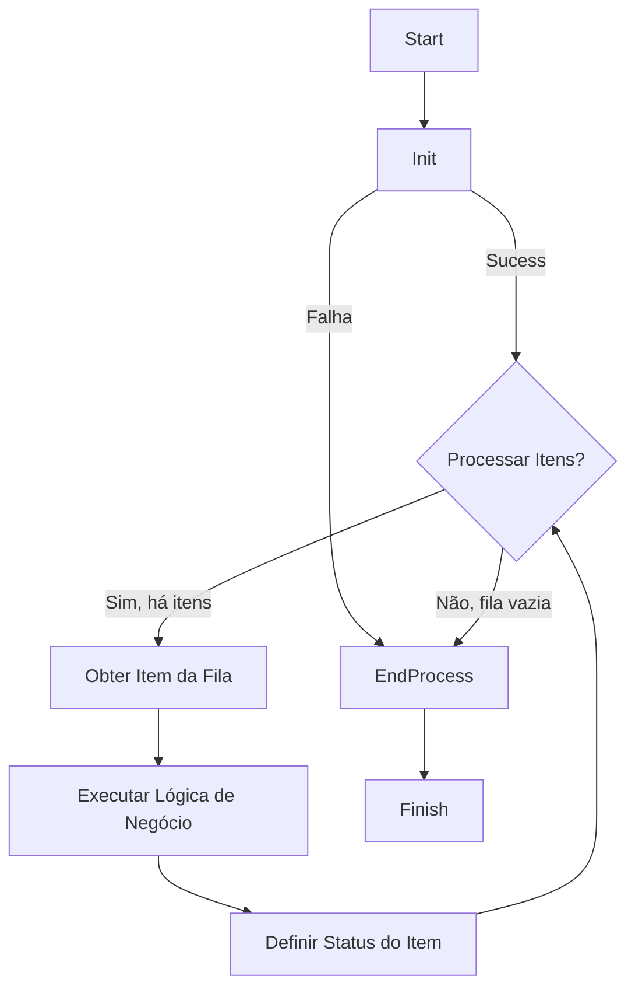

# Guia Mestre de Arquitetura e Estimativa para Automações RPA

Este documento é a fonte canônica da verdade para o design, desenvolvimento e estimativa de todos os projetos de Automação Robótica de Processos (RPA) utilizando o Framework T2C. Seu propósito é estabelecer um framework rigoroso que garanta que cada automação seja Robusta, Escalável, Manutenível e Previsível.

---

## 1. Introdução e Filosofia

Este não é mais um guia; é a **Bíblia da Arquitetura de Automação**. Ele foi projetado para ser o único documento de referência necessário para qualquer pessoa (ou IA) projetar, nomear, estimar e implementar um projeto de RPA, garantindo que o resultado final siga os padrões de excelência definidos.

A filosofia central é a **decomposição inteligente**: processos de negócio complexos são quebrados em robôs especialistas, e robôs são quebrados em tarefas funcionais claras. Esta granularidade é a base para a resiliência e a previsibilidade.

---

## 2. Componentes Fundamentais da Arquitetura de Automação

Toda automação é construída a partir de um conjunto de componentes e padrões arquiteturais. Compreendê-los é o primeiro passo para um design robusto.

### 2.1 Filas (Queues): O Coração da Automação

A fila é o componente central do nosso ecossistema. Ela é a fonte da verdade para o trabalho a ser feito.

*   **O que é?** Uma lista estruturada de itens de trabalho. Cada item (ou "transação") representa uma unidade de processamento (ex: uma nota fiscal para validar, um cliente para cadastrar).
*   **Por que é Obrigatória?**
    *   **Desacoplamento:** O robô que cria o trabalho (Produtor) não precisa saber nada sobre o robô que o executa (Consumidor). Eles só precisam concordar com o "contrato" da fila.
    *   **Escalabilidade:** Para aumentar a vazão, basta adicionar mais robôs consumidores à mesma fila, sem alterar a arquitetura.
    *   **Resiliência:** Se um robô falhar ao processar um item, o item pode ser retentado automaticamente ou marcado para análise humana sem perder o trabalho.
    *   **Auditabilidade:** As filas fornecem um log completo de todos os itens processados, pendentes e com falha.

### 2.2 A Anatomia de um Robô: O Ciclo de Vida da Execução

Todo robô, independentemente de sua função, deve seguir uma estrutura de execução padronizada em três estágios, inspirada no "Robotic Enterprise Framework" (REFramework).

#### 1. Init (Inicialização)
*   **Propósito:** Preparar todo o ambiente necessário para a execução. É a fase de "tudo ou nada".
*   **Ações Típicas:** Ler arquivos de configuração, obter credenciais, fazer login em todas as aplicações necessárias (SAP, portais web, etc.), inicializar variáveis.
*   **Regra de Ouro:** Se qualquer passo no Init falhar, o robô deve encerrar a execução imediatamente e reportar o erro. Nenhum item da fila deve ser processado se o ambiente não estiver 100% pronto.
*   **Implementação:** Método `T2CInitAllApplications.execute()`.

#### 2. Main Transaction Loop (Onde o Trabalho Acontece)
*   **Propósito:** Processar um item da fila por vez, de forma isolada e transacional.
*   **Fluxo Obrigatório:**
    1.  **Obter Item da Fila:** Pega o próximo item disponível. Se não houver itens, o loop termina e o robô vai para o End Process.
    2.  **Processar Item:** Executa a lógica de negócio principal daquele robô.
    3.  **Definir Status do Item:** Ao final do processamento, o robô deve marcar o item com um dos três status:
        *   **Sucesso:** O item foi processado completamente e com sucesso.
        *   **Exceção de Negócio:** O item não pôde ser processado devido a uma regra de negócio (ex: "documento inválido", "cliente não encontrado"). Isso não é um erro do robô; é um resultado esperado.
        *   **Exceção de Aplicação:** Ocorreu um erro inesperado (ex: o sistema travou, um seletor não foi encontrado, a API retornou erro 500). O item deve ser retentado automaticamente, se configurado.
*   **Implementação:** Método `T2CProcess.execute()`.

#### 3. End Process (Finalização)
*   **Propósito:** Encerrar a operação de forma limpa e segura.
*   **Ações Típicas:** Fazer logout de todas as aplicações, fechar conexões com bancos de dados, gerar e enviar um relatório de resumo da execução.
*   **Regra de Ouro:** O End Process deve ser executado sempre, quer o Main Loop tenha sido bem-sucedido, quer tenha sido interrompido por uma falha no Init.
*   **Implementação:** Método `T2CCloseAllApplications.execute()`.



### 2.3 O Robô Dispatcher: O Maestro da Orquestração

O Dispatcher é um tipo especializado de robô cuja única responsabilidade é popular as filas de trabalho. Ele atua como o maestro que prepara a orquestra antes do concerto.

*   **Quando é Necessário?**
    *   Quando os dados de entrada vêm de múltiplas fontes (ex: e-mails, pastas de rede, planilhas).
    *   Quando é necessária uma lógica de filtragem complexa para determinar o que deve ser processado.
    *   Quando os dados precisam ser enriquecidos ou pré-validados antes de entrarem na fila principal.
*   **O que ele NÃO Faz:** Ele nunca executa a lógica de negócio principal do processo. Ele apenas prepara e enfileira o trabalho para os robôs Performers.

---

## 3. Princípios Avançados de Design de Arquitetura

### 3.1 O Princípio da Responsabilidade Única (PRU)
Cada robô é um especialista. A quebra de responsabilidades é a base de um design limpo. Se um processo faz "A, B e C", e C é independente de A e B, considere separar em robôs distintos.

### 3.2 O Princípio do Acionamento por Fila (Queue-Driven)
Todos os robôs performers devem ser acionados por filas, conforme definido na Seção 2.1. A fila é a única fonte de dados para o `T2CProcess.execute()`.

### 3.3 O Padrão da Fronteira Assíncrona (Ex: Verifai)
Este padrão é **obrigatório** quando a automação depende de um serviço externo que não fornece uma resposta imediata (ex: OCR assíncrono, processamento humano, APIs lentas).

*   **O Problema:** Manter um robô "preso" esperando uma resposta que pode levar minutos ou horas é ineficiente.
*   **A Solução (Obrigatória):** O fluxo é quebrado em dois robôs:
    1.  **Robô Sender:** Sua lógica termina ao enviar o documento/solicitação e receber um ID de acompanhamento (job_id). Ele popula uma "fila de resultados pendentes" com este ID.
    2.  **Robô Receiver:** Consome da fila de resultados pendentes, usa o job_id para consultar o status e, se pronto, continua o processo.

---

## 4. Nomenclatura e Contratos de Dados

A padronização de nomes é crucial para a manutenção e identificação rápida de componentes.

### 4.1 Nomenclatura de Projetos (Robôs)
*   **Estrutura:** `prj_<Cliente>_<ID>_<Nome>`
*   **Exemplo:** `prjKEAID09ASN_CREATOR`

### 4.2 Nomenclatura de Filas
*   **Estrutura:** `Queue_<Cliente>_<ID>_<Nome>`
*   **Exemplo:** `QueueKEAID09ASNCREATIONREQUESTS`

### 4.3 Schemas de Fila (O Contrato de Dados)
Toda fila deve ter um schema de dados (payload) formalmente definido. No Framework T2C, isso é gerenciado no dicionário `info_adicionais` do item da fila.

### 4.4 Padrões de Código (Variáveis, Classes e Métodos)
Para manter o código legível e consistente:

*   **Variáveis:** `var_<tipo><Nome>` (ex: `var_strNome`, `var_intContador`, `var_dictItem`).
*   **Argumentos:** `arg_<tipo><Nome>` (ex: `arg_strReferencia`, `arg_dictDados`).
*   **Constantes:** `CONS_<TIPO>_<NOME>` (ex: `CONS_STR_URL_BASE`).
*   **Classes:** PascalCase (ex: `T2CProcess`, `T2CQueueManager`).
*   **Métodos:** snake_case (ex: `execute()`, `add_to_queue()`).

---

## 5. Framework de Estimativa de Esforço (FEFP)

Método padrão para estimar o esforço de desenvolvimento.

**Passo 1: Decomposição em Tarefas Orientadas à Ação**
Decompor o robô em Init, Main e End. Cada tarefa deve ser uma ação específica (ex: "Clicar em botão Login", "Extrair tabela de itens").

**Passo 2: Avaliação de Complexidade**
Pontuação (4-12) baseada em:
1.  **Interação:** API/DB (1), Web Moderna (2), Legado/SAP (3).
2.  **Lógica:** Linear (1), Condicional (2), Regras Cruzadas (3).
3.  **Dados:** Estruturado (1), Semi (2), Não-estruturado (3).
4.  **Resiliência:** Padrão (1), Retentativas (2), Recuperação Avançada (3).

**Passo 3: Tempo Base**
*   4-5 pts: 1.0 - 1.5h
*   6-7 pts: 2.0 - 3.0h
*   8-9 pts: 4.0 - 6.0h
*   10-12 pts: 7.0 - 8.0h

**Passo 4: Estimativa Final**
`Tempo Final = ArredondarParaCima(Tempo Base * 1.35, 0.5)`

---

## 6. Apêndice: Exemplo de Aplicação (Projeto KEA)

| Robô | Bloco | Ação | Pontuação | Tempo Base | Est. Ajustada |
|---|---|---|---|---|---|
| prj_KEA_ID01_INGESTION | Init | Conectar IMAP | 6 | 2.0 | 3.0 |
| | Main | Extrair Regex | 9 | 5.0 | 7.0 |
| | End | Enviar relatório | 6 | 2.0 | 3.0 |

---

## 7. Guia Definitivo de Construção de Código

Este guia define as normas OBRIGATÓRIAS para a geração de qualquer linha de código. O objetivo é criar códigos **simples, práticos e robustos**.

### 7.1 Nomenclatura Padrão e Rigorosa

A aderência estrita a prefixos e estruturas é mandatória para identificação visual imediata.

| Artefato | Estrutura e Regras Principais | Exemplo |
| :--- | :--- | :--- |
| **Projeto** | `prj_<Empresa>_<Sigla/ID>_<SubSigla?>_<Seq>_<Sistema>` | `prj_LeroyMerlin_CCRT_01_SAP` |
| **Pacotes** | `snake_case` | `conexao_banco`, `utils` |
| **Módulos** | `snake_case` (Prefixo `_` se privado) | `banco_t2c.py`, `_helper.py` |
| **Classes** | `PascalCase` (Prefixo `_` se privada) | `BancoT2C`, `_Logger` |
| **Variáveis** | `var_<tipo><Conteudo>` (camelCase) | `var_strEmailRemetente` |
| **Parâmetros** | `arg_<tipo><Conteudo>` (camelCase) | `arg_intTentativas` |
| **Constantes** | `CONS_<TIPO>_<CONTEUDO>` (UPPER_SNAKE) | `CONS_FLT_PI` |
| **Funções** | `snake_case()` (Prefixo `_` se privada) | `envia_email()`, `_validar()` |
| **Exceções** | `PascalCase` (Sufixo Exception opcional) | `BusinessRuleException` |

**Tipos de Dados e TypeHints:**
*   Sempre usar TypeHints quando o tipo não for inferido automaticamente.
*   Correlação obrigatória:
    *   `str` -> `var_strNome`
    *   `int` -> `var_intIdade`
    *   `float` -> `var_fltValor`
    *   `list` -> `var_listItens`
    *   `dict` -> `var_dictDados`
    *   `bool` -> `var_boolAtivo`

### 7.2 Estrutura e Organização de Arquivos

1.  **Separação por Sistema:** As pastas do projeto devem ser organizadas por sistema ou aplicação alvo (ex: `sap/`, `portal_governo/`, `salesforce/`).
2.  **Pasta Utils:** Código genérico e reutilizável DEVE ir para a pasta `utils`. Não duplique lógica.
3.  **Classes Autocontidas:** As classes devem funcionar de forma similar a bibliotecas (como pandas).
    *   Preferir `@staticmethod` e `@classmethod` para evitar necessidade de instância desnecessária.
    *   Profundidade de herança máxima: 4 níveis.

### 7.3 Qualidade e Robustez do Código

1.  **Comentários:** Use com bom senso. Explique o "porquê" de lógicas complexas. Não explique o óbvio (ex: não comente "clica no botão" acima de um comando `.click()`).
2.  **Loops Seguros:**
    *   Todo `while` deve ter **DUPLA CONDIÇÃO** de parada: a condição de negócio E um contador de tentativas máximas.
    *   Isso previne loops infinitos que travam a automação.
    ```python
    tentativa = 0
    while condicao_negocio and tentativa < max_tentativas:
        # logica
        tentativa += 1
    ```
3.  **Tratamento de Erros (Explicit is better than implicit):**
    *   **Uso Proativo do Raise:** Use `raise` para interromper o fluxo assim que uma regra de negócio falhar.
    *   **Evite Else/Ifs Aninhados:** Prefira "Guard Clauses" (verificações no início que dão raise/return).
    *   **Distinção Clara:**
        *   `Exception`: Erro de sistema/aplicação (o framework tenta novamente).
        *   `BusinessRuleException`: Erro de negócio (o framework marca o item e segue para o próximo).
4.  **Estruturas Condicionais:** Evite aninhamento profundo. Use `and`/`or` ou atribuições ternárias para simplificar.

### 7.4 Diretrizes Específicas do Framework T2C

1.  **Ponto de Entrada:** A inicialização de aplicações ocorre **exclusivamente** em `T2CInitAllApplications.py`.
2.  **Maestro:** O framework suporta operação COM ou SEM Maestro.
    *   Para dev/teste local: Pode deixar configs em branco.
    *   Para Produção (RAAS): Uso do Maestro é OBRIGATÓRIO para contabilização.
3.  **Relatórios Customizados:**
    *   Para adicionar dados ao relatório analítico, não crie arquivos paralelos.
    *   Edite `Script_Select_Analitico.sql` para extrair chaves do JSON `detalhes_item_fila`.
    *   No código, use `update_add_details_queue_item` e `update_change_value_details_queue_item`.

### 7.5 Técnicas Avançadas de Automação

1.  **SAP:**
    *   Sempre inicie o SAP **via código** (linha de comando/atalho) para garantir que o "Scripting support" seja ativado corretamente.
    *   Use `cc.sap.login()` do Clicknium para login direto.
2.  **Clicknium Locators Dinâmicos:**
    *   Não crie múltiplos locators para elementos em lista.
    *   Use a sintaxe `{{parametro}}` nas propriedades do locator.
    *   Na chamada: `find_element(locator.item, locator_variables={'parametro': 'valor'})`.
3.  **Data Scraper:** Sempre prefira o Data Scraper do Clicknium para extrair tabelas HTML inteiras em vez de iterar linhas.
4.  **Pop-ups e Instabilidade:**
    *   Se detecção automática falhar, use IA (Computer Vision) para reconhecer o pop-up.
    *   Use biblioteca `tenacity` para retentativas inteligentes em ações instáveis (ex: abrir navegador).
5.  **Contexto RAAS:**
    *   A inserção de dados para processamento em RAAS ocorre via envio de e-mail para `raas@t2cgroup.com.br` (com credenciais específicas).

### 7.6 Estratégia de Desenvolvimento Modular (Workflow de Tarefas)

**O OBJETIVO ÚNICO:** A IA deve gerar apenas o código da **classe especialista** isolada que resolve a tarefa solicitada.

**O QUE NÃO FAZER:**
*   ❌ Não gerar ou reescrever `bot.py`.
*   ❌ Não gerar ou reescrever `T2CProcess.py`.
*   ❌ Não gerar ou reescrever `InitAllApplications.py`.

**O QUE FAZER (Output Esperado):**
1.  O código completo da nova classe (seguindo todas as regras de nomenclatura e boas práticas).
2.  Um breve exemplo de como instanciar/chamar essa classe (para o desenvolvedor copiar e colar no arquivo principal).

**Exemplo Prático de Entrega Esperada:**

*Task:* "Ler planilha de input e validar linhas."

**1. Arquivo para o Desenvolvedor Criar:** `classes_t2c/excel/leitor_input.py`

```python
# Imports apenas do necessário
import pandas as pd
from {{PROJECT_NAME}}.classes_t2c.utils.T2CExceptions import BusinessRuleException

class LeitorInput:
    """
    Classe especialista para manipulação do Excel de Input.
    """

    @staticmethod
    def ler_e_validar_planilha(arg_strCaminhoArquivo: str) -> list:
        """
        Lê o Excel e valida se as colunas obrigatórias existem.
        """
        var_listDadosValidados = []
        
        try:
            var_dfDados = pd.read_excel(arg_strCaminhoArquivo)
        except Exception as e:
            raise Exception(f"Erro ao abrir arquivo Excel: {e}")

        # Validação de Regra de Negócio
        if "CPF" not in var_dfDados.columns:
            raise BusinessRuleException("Coluna 'CPF' não encontrada na planilha de input.")

        var_listDadosValidados = var_dfDados.to_dict('records')
        
        return var_listDadosValidados
```

**2. Snippet de Uso (Para o Dev colar no T2CProcess ou Init):**

```python
# Importação
from {{PROJECT_NAME}}.classes_t2c.excel.leitor_input import LeitorInput

# Chamada
var_listItens = LeitorInput.ler_e_validar_planilha(r"C:\Caminho\Input.xlsx")
```
